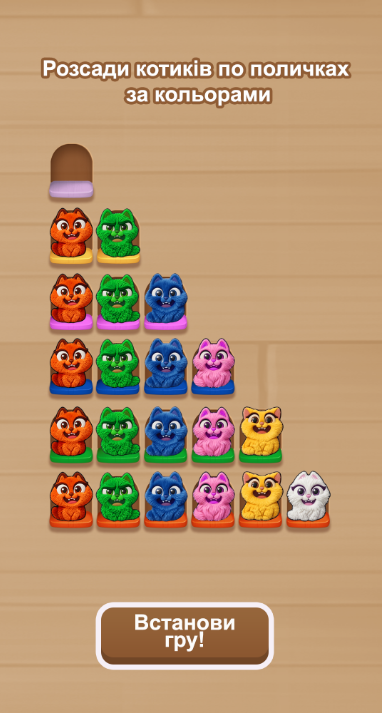
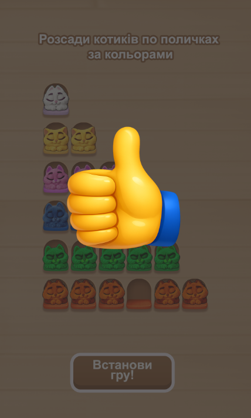

### Гра сортування котиків

Ігрове поле \- це 6 рядків різнокольорових поличок: 1 біла, 2 жовті, 3 рожеві, 4 синіх, 5 зелених, 6 оранжевих. На цих поличках сидять кольорові котики. Кількість котів відповідає кількості поличок, окрім оранжевих \- їх на 1 менше.   
Кожен кіт має 3 стани: idle, select, sleep.   
Задача гравця розсортувати котів по поличках відповідних кольорів.   
Для сортування гравець має обрати кота натисканням, стан кота змінюється на select і кіт в цьому стані перелітає на вільну поличку. Після переміщення на вільну поличку кіт змінює стан з select на idle.   
Якщо всі полички рядка зайняті котами відповідного кольору, то стан всіх котів на цьому рядку змінюється на sleep. Виключення лише для оранжевих поличок, там котів на 1 менше ніж поличок.

Котів в стані sleep переміщати не можна.

Після того як всі коти перейшли в стан sleep виводимо win screen \- напівпрозорий темний екран і зображення “лайк”. Лайк має бути заанімованим (баунс, ротейт, на твій розсуд).

Додатково на екрані є:  
CTA “Розсади котиків по поличках за кольорами”. Напис має демонструвати анімацію раз на 5 секунди (наприклад баунс, ротейт \- на твій вибір)  
Кнопка “Встанови гру\!”. При натисканні на кнопку \- перехід за зовнішним посиланням (на твій вибір). Кнопка має бути анімована, програвати активність кожні 3 секунди (баунс, ротейт, на твій смак)

Побажання щодо реалізації:

- Мова: JavaScript (в команді ми працюємо з PixiJS);
- Підхід до анімації будь яких елементів на твій вибір, імпровізація вітається.
- Плейбл має адаптуватися для форматів: iPhone SE (375x667, 667x375); iPhone14 Pro Max (430x932, 932x430); iPad Mini (768x1024, 1024x768); iPad Pro (1024x1366, 1366x1024). Розшташування елементів плейблу на різних форматах \- на твій розсуд.
- Звукове оформлення не вимагається
- Анімація появи елементів при завантаженні гри \- на твій розсуд.

Будь ласка, занотуй скільки часу займе виконання тестового:

- підготовка
- написання ігрової механіки
- анімація елементів
- верстка ресайзів

#### Як результат тестового очікуємо:

- посилання на превью плейблу, що відкриється і відпрацює в броузері;
- html-файл, що може працювати локально \- за окремим запитом;
- файл проєкту (вихідний код) \- залий на драйв з доступом по лінку.